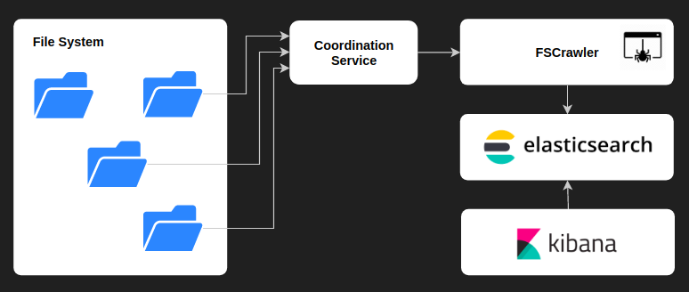

.. Backup solution for docker deployment documentation master file, created by
   sphinx-quickstart on Sun Jun 30 00:13:06 2019.
   You can adapt this file completely to your liking, but it should at least
   contain the root `toctree` directive.

How it works?
=============

The indexation starts by configuring the desired locations to parse for files, then starting the required services witch run as docker containers (ElasticSearch, Kibana, FScrawler).

A coordination service maps the documents to FScrawler, creates the necessary crawling jobs and ingest pipelines and instructs FScrawler to start indexing.

Once finished, you can create your index mappings and start using queries from the Kibana dashboard.

