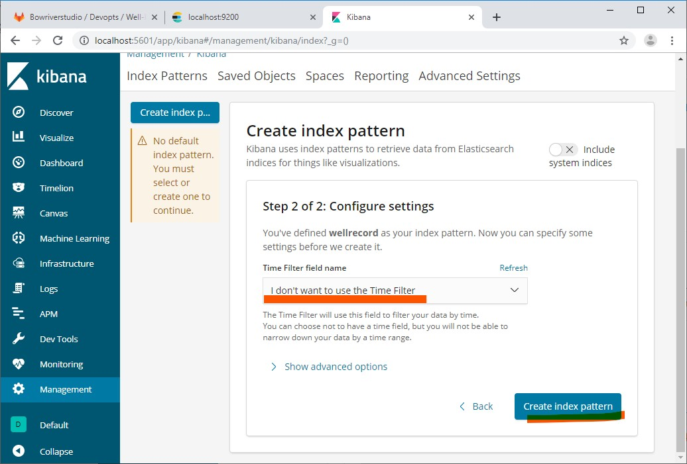

.. Backup solution for docker deployment documentation master file, created by
   sphinx-quickstart on Sun Jun 30 00:13:06 2019.
   You can adapt this file completely to your liking, but it should at least
   contain the root `toctree` directive.

Index configuration
===================

To query the index in Kibana, configure it under the 'Management' menu:

- Under the index patterns, Define a new pattern by typing ``wellrecord``.
	

- Configure the time filtering field of your index.

Index querying
==============

Under 'Discover', select the fields to filter results to. Here we are using the 'content' and 'filer url' feilds.

Create a query in the search field. In the given example we are querying for files with containing keyword "1AA063409108W400" so the query is ``"content:"1AA063409108W400"``.

