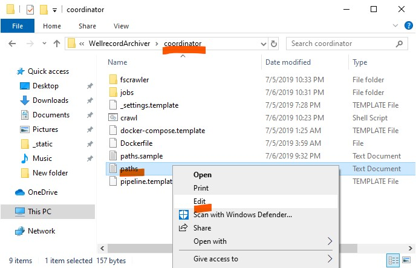
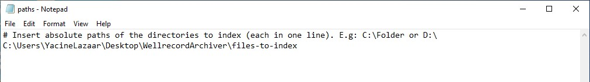
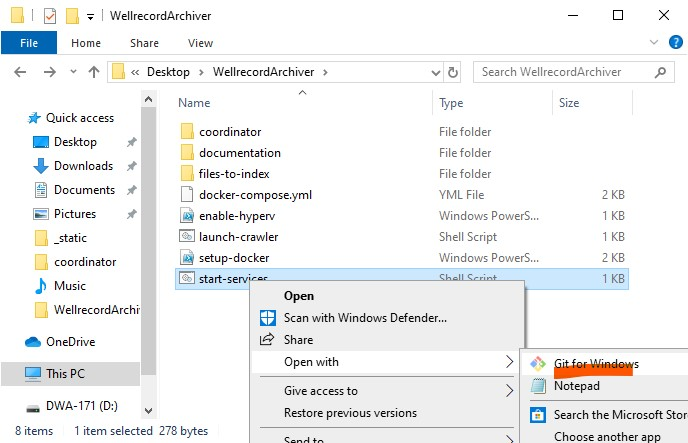
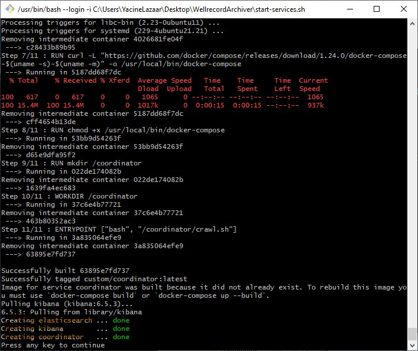
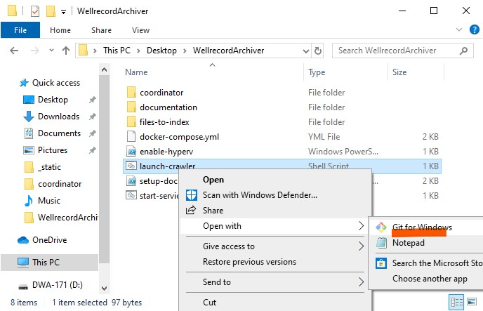
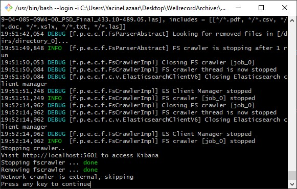

.. Backup solution for docker deployment documentation master file, created by
   sphinx-quickstart on Sun Jun 30 00:13:06 2019.
   You can adapt this file completely to your liking, but it should at least
   contain the root `toctree` directive.

Configuration
=============

Before starting the crawler and indexing the content, You need to feed the crawler an input so it knows what locations to index:
	
- Under the ``WellrecordArchiver > coordinator`` folder, copy the ``paths.example.txt`` file to ``path.txt`` within the same folder.

- Edit ``paths.txt`` with notepad. Follow the given example and add each folder path in a seperate line.

Run
===

Start the services
^^^^^^^^^^^^^^^^^^

- Let's start the dependencies first. On the ``WellrecordArchiver``, right-click ``start-services`` file and open it with  ``Git Windows``.

- For the first run, Docker will pull the appropriate images from its registry so it will take a while. Eventually the services will start.

Start the crawler
^^^^^^^^^^^^^^^^^^

- In the same fashion, Right-click ``launch-crawler`` file and open it with  ``Git Windows``.

- The coordinator will prepare the necessary crawling jobs and summon the crawler.

- Once finished, go to the Kibana dashboard (http://localhost:5601) to check the index.

