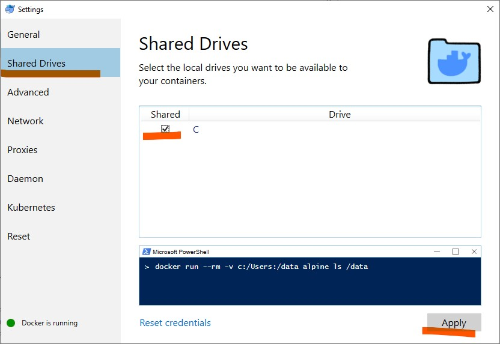

.. Backup solution for docker deployment documentation master file, created by
   sphinx-quickstart on Sun Jun 30 00:13:06 2019.
   You can adapt this file completely to your liking, but it should at least
   contain the root `toctree` directive.

Setup
=====

Requirements:

- Git.
- Docker and Docker Compose.
- Enable Hyper-V

Install Git
-----------

- Copy and paste this link into your web browser to download Git setup file: https://git-scm.com/download/win
- Once downloaded, run the the setup with the default options.

Cloning Repository
------------------

- Create a Gitlab account at https://gitlab.com/users/sign_in
- Make sure are granted access to the required repositoriy ``gitlab.com/geolinkis/wellrecordarchiver.git`` by the owner.
- On your desktop, create a new folder and name it ``WellrecordArchiver``.
- While holding the ``Shift`` key, right-click the ``WellrecordArchiver`` folder and select ``Open Powershell window here``.

- Copy the following command into your Powershell console and press enter to execute it:

.. code-block:: bash

	git clone https://gitlab.com/geolinkis/wellrecordarchiver.git ./

- Input your Gitlab username and password to proceed.
- After the cloning is done, the files should be present on your folder.

Enable Hyper-V
--------------

- On the ``WellrecordArchiver`` folder, right-click on ``enable-hyperv`` file and select ``Run with Powershell``.
- Grant the script administrator access so it can enable the proper Windows features.

Install Docker
--------------

- On the ``WellrecordArchiver`` folder, right-click on ``setup-docker`` file and select ``Run with Powershell``. 

- The setup file will be downloaded and executed. Once its starts, follow the setup wizard and keep the options to default.

- When the setup is finalized, run Docker by double clicking the 'Docker Desktop'. Check the icon on the system tray for it's status.

- Once Docker is running, We need to give it access to the drives to index. On the system tray, right-click the docker icon and click on settings.

- Go to the 'Shared Drives' tab and make sure that the 'C drive' is ticked. You need also to grant access to the directories you are willing to index so make sure the drives where those directories reside are selected too.

- We need to allocate more memory to our services to run, but Docker is defaulted to only 2gb of memory usage so we need to change that. Go to the 'Advanced' tab and adjust the memory usage of Docker to 4gb (around 4096mb). Click 'Apply' to save and wait for Docker to restart.

Your setup is now ready for configuration and launch.
 
